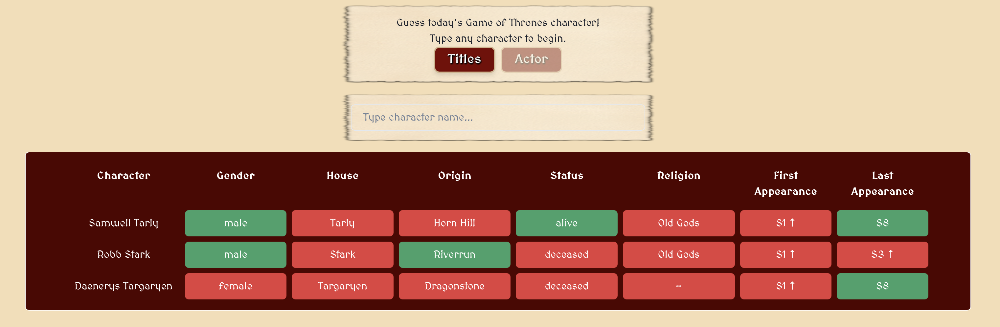
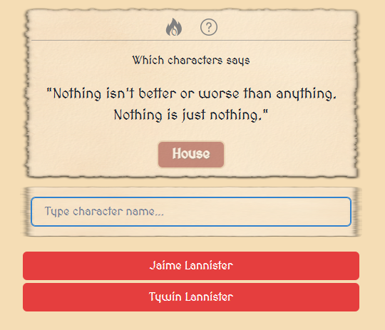
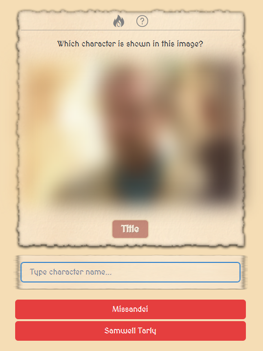
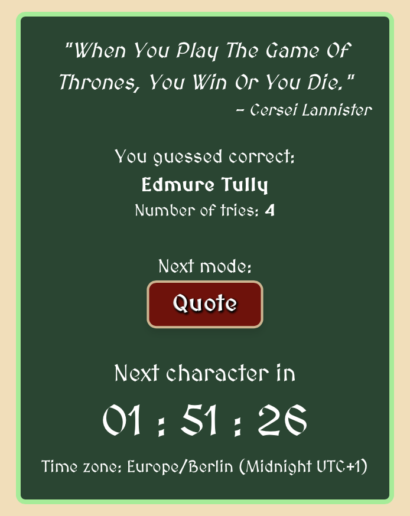
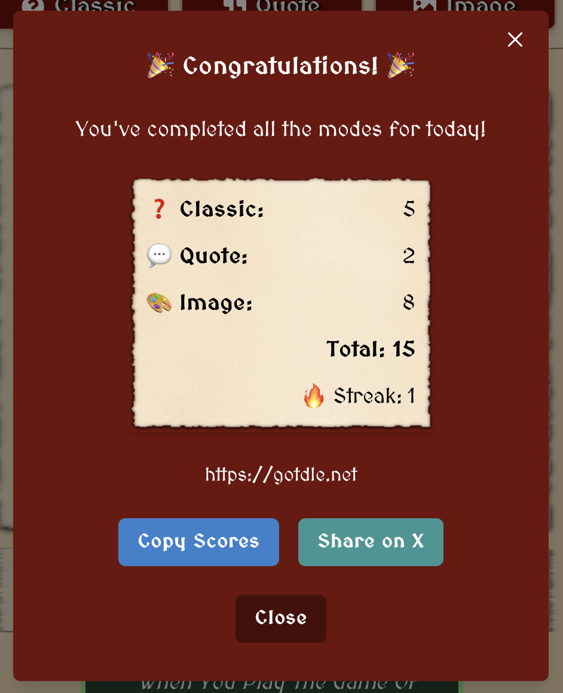
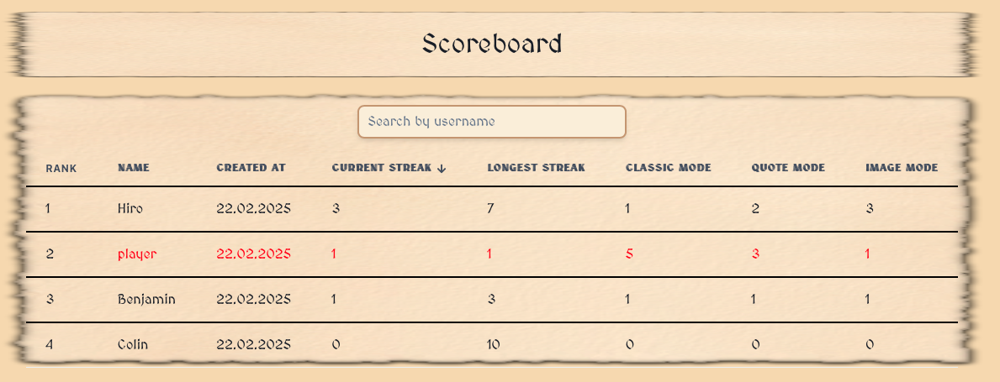
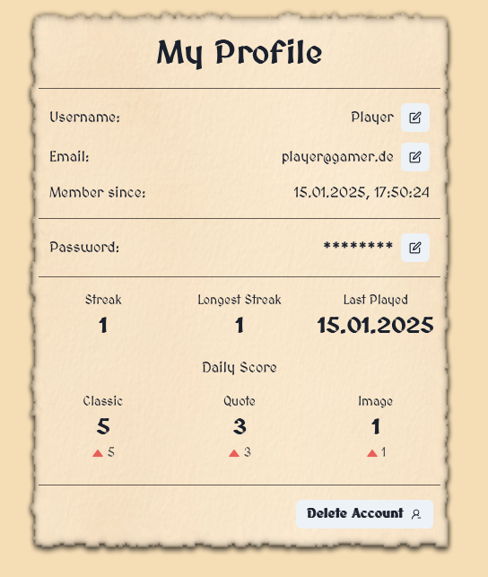
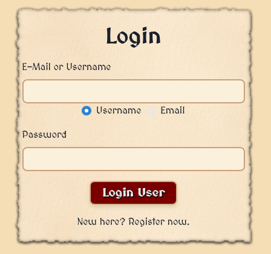
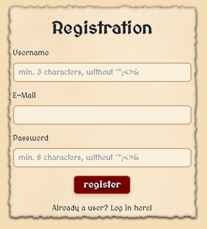

# FWE WS24/25 Project GoTdle

## Table of Contents

1. [Getting started](#getting-started)
2. [Application Functionalities](#application-functionalities)
3. [Routes](#routes)
4. [Testing](#testing)

## Getting started

### Prerequisites

Ensure the following software components are installed on your PC:

- [ ] Node.js (JavaScript runtime environment)
- [ ] npm (Node Package Manager)
- [ ] Git
- [ ] Docker and Docker Compose

1. Install __Node.js__ and __npm__

   Visit the [Node.js website](https://nodejs.org/).
   Download the recommended version for your platform (LTS version is recommended).
   Follow the installation instructions for your operating system.
   Verify the installation:

    ```bash
    node -v
    npm -v
    ```

2. Install __Git__

   Visit the [Git website](https://git-scm.com/).
   Download the recommended version for your platform.
   Follow the installation instructions for your operating system.
   Verify the installation:

    ```bash
    git --version
    ```

3. Install __Docker__ and __Docker Compose__

   Visit the [Docker website](https://www.docker.com/).
   Download the recommended version for your platform.
   Follow the installation instructions for your operating system.
   Verify the installation:

    ```bash
    docker --version
    docker-compose --version
    ```

### Clone the Repository

Clone the repository to your local machine:

```bash
git clone https://code.fbi.h-da.de/sthiohnoo/gotdle.git
```

### Backend Setup

### Step 1: Navigate to the Backend Directory

```bash
cd gotdle/backend
```

### Step 2: Install Dependencies

Install the necessary dependencies using npm:

```bash
npm install
```

### Step 3: Set Up Environment Variables

To configure the application to use the database in Docker, follow these steps:

1. Create a `.env` file in the src directory and copy the `.env.example` file content into it.
2. Edit the `.env` file and replace the placeholders(user, password, database) with the actual values from
   `docker-compose.yml`

### Step 4: Set Up the Database

Set up the database using Docker Compose:

```bash
docker-compose up -d
```

### Step 5: Migrate the Database

Run the database migrations to create the necessary tables:

```bash
npm run db:migrate
```

### Step 6: Build the Backend

```bash
npm run build
```

### Step 7: Start the Backend

```bash
npm start
```

## Frontend Setup

### Step 1: Navigate to the frontend directory:

```bash
cd frontend
```

### Step 2: Install Dependencies

Install the necessary dependencies using npm:

```bash
npm install
```

### Step 3: Build the Frontend

```bash
npm run build
```

### Step 4: Start the Frontend

```bash
npm run preview
```

### Step 4: Access the Application

Open a browser and navigate to `http://localhost:4173/` or click the link in the terminal.

## Application Functionalities

- [ ] __Manage Users:__ Create, read, update, and delete users.
- [ ] __Manage Scores:__ Playing the game will update the user's score and can be seen in the leaderboard.
- [ ] __Manage Streaks:__ Playing all Modes will increase the user's streak and can be seen in the leaderboard.
- [ ] __Play Game:__ Play the 3 Modes with daily updated questions with internal and external APIs.

## Classic Mode



- [ ] **Guess Characters:**  
  Try to guess a character, and your guess will be added to a grid.  
  The grid reveals whether the attributes match the correct character:
    - **Green:** The attribute matches.
    - **Red:** The attribute does not match.  
      For **First Appearance** and **Last Appearance**, incorrect guesses will display an arrow indicating if the
      correct value is higher or lower.

### Character Attributes

| **Attribute**        | **Examples**                     | **Description**                               |
|----------------------|----------------------------------|-----------------------------------------------|
| **Gender**           | Female, Male                     | Specifies the character's gender.             |
| **House**            | Targaryen, Stark, etc.           | Indicates the house the character belongs to. |
| **Origin**           | Winterfell, King's Landing, etc. | Defines the character's place of origin.      |
| **Status**           | Alive, Deceased, Unknown         | Shows the character's current status.         |
| **Religion**         | Old Gods, Many-Faced God, etc.   | The religion the character follows.           |
| **First Appearance** | S1 - S8                          | The season when the character first appeared. |
| **Last Appearance**  | S1 - S8                          | The season when the character last appeared.  |

### Hints

- [ ] **Titles:** Shows the character's titles.
    - enabled after 3 incorrect guesses
- [ ] **Actor:** Shows the actor who played the character.
    - enabled after 6 incorrect guesses

## Quotes Mode



- [ ] **Guess Quotes:**
- Try to guess the character who said the quote.
- The color of the box of the character will reveal the guess:
    - **Green:** The quote matches the character.
    - **Red:** The quote does not match the character.

## Image Mode



- [ ] **Guess Characters by a blurred image:**
- Try to guess the character from the image.
- The image will be blurred initially, and every incorrect guess will make the image slightly less blurred.
    - Up to 20 times
- The color of the box of the character will reveal the guess:
    - **Green:** The image matches the character.
    - **Red:** The image does not match the character.

## Success Box



- [ ] **Displayed everytime a mode is completed:**
- Shows the correct answer and the user's score.
- The user can choose to play the next mode
    - when all modes are completed, it directs the user to the leaderboard.
- The time until the next character is revealed

## Score Box



- [ ] **Displayed when all modes are completed:**
- Shows the user's score in each mode and the total score.
- Shows the streak of the user (length of daily made completions of the game without missing a day).
- The user can copy the score to the clipboard and share it with friends.
- The user can share directly to Twitter.

## Scoreboard



- [ ] **Displayed when the user clicks on the leaderboard button:**
- Shows a table of all users
- contains the user's name, rank, created at, current streak, longest streak and scores in each mode.
- can be sorted by all columns by clicking on the column name and will be indicated by an arrow.

## Profile



- [ ] **Displayed when the user clicks on the profile button:**
- Shows the username, email, member since, current streak, longest streak, last played and scores in each mode.
- For every mode the user can see the improvement or decrease in the score compared to the last time the mode was
  played.
- The user can change the username and email and passwort.
- The user can delete the account after entering the password.

## Login



- [ ] **Displayed when the user is not logged in or clicks on the login button:**
- The user can log in with the username or email and password.
- The user can swap between login with username or email.
- The user can click on the register button to register a new account.

## Register



- [ ] **Displayed when the user clicks on the register button:**
- The user can register with a username, email and password.
- If the user is already registered, the user can click on the "Log in here!" text to change to the login page.
- The username needs to be unique and the email needs to be a valid email address.
- The password needs to be at least 8 characters long.

## Test and Deploy

Use the built-in continuous integration in GitLab.

- [ ] [Get started with GitLab CI/CD](https://docs.gitlab.com/ee/ci/quick_start/index.html)
- [ ] [Analyze your code for known vulnerabilities with Static Application Security Testing (SAST)](https://docs.gitlab.com/ee/user/application_security/sast/)
- [ ] [Deploy to Kubernetes, Amazon EC2, or Amazon ECS using Auto Deploy](https://docs.gitlab.com/ee/topics/autodevops/requirements.html)
- [ ] [Use pull-based deployments for improved Kubernetes management](https://docs.gitlab.com/ee/user/clusters/agent/)
- [ ] [Set up protected environments](https://docs.gitlab.com/ee/ci/environments/protected_environments.html)

***

# Editing this README

When you're ready to make this README your own, just edit this file and use the handy template below (or feel free to
structure it however you want - this is just a starting point!). Thanks
to [makeareadme.com](https://www.makeareadme.com/) for this template.

## Suggestions for a good README

Every project is different, so consider which of these sections apply to yours. The sections used in the template are
suggestions for most open source projects. Also keep in mind that while a README can be too long and detailed, too long
is better than too short. If you think your README is too long, consider utilizing another form of documentation rather
than cutting out information.

## Name

Choose a self-explaining name for your project.

## Description

Let people know what your project can do specifically. Provide context and add a link to any reference visitors might be
unfamiliar with. A list of Features or a Background subsection can also be added here. If there are alternatives to your
project, this is a good place to list differentiating factors.

## Badges

On some READMEs, you may see small images that convey metadata, such as whether or not all the tests are passing for the
project. You can use Shields to add some to your README. Many services also have instructions for adding a badge.

## Visuals

Depending on what you are making, it can be a good idea to include screenshots or even a video (you'll frequently see
GIFs rather than actual videos). Tools like ttygif can help, but check out Asciinema for a more sophisticated method.

## Installation

Within a particular ecosystem, there may be a common way of installing things, such as using Yarn, NuGet, or Homebrew.
However, consider the possibility that whoever is reading your README is a novice and would like more guidance. Listing
specific steps helps remove ambiguity and gets people to using your project as quickly as possible. If it only runs in a
specific context like a particular programming language version or operating system or has dependencies that have to be
installed manually, also add a Requirements subsection.

## Usage

Use examples liberally, and show the expected output if you can. It's helpful to have inline the smallest example of
usage that you can demonstrate, while providing links to more sophisticated examples if they are too long to reasonably
include in the README.

## Support

Tell people where they can go to for help. It can be any combination of an issue tracker, a chat room, an email address,
etc.

## Roadmap

### Stand? Ende der letzten Staffel?

- Klassik Mode: Charaktere erraten -> Alter, Geschlecht, Haus, Tod, Religion
- Quotes Mode: Zitate erraten
- Emoji Mode: Anhand von Emojis Charaktere erraten
- Bilder Mode: Anhand von Bildern die hereingezoomt sind Charaktere erraten
- Karten Mode: Orte auf einer Karte erraten

## Contributing

State if you are open to contributions and what your requirements are for accepting them.

For people who want to make changes to your project, it's helpful to have some documentation on how to get started.
Perhaps there is a script that they should run or some environment variables that they need to set. Make these steps
explicit. These instructions could also be useful to your future self.

You can also document commands to lint the code or run tests. These steps help to ensure high code quality and reduce
the likelihood that the changes inadvertently break something. Having instructions for running tests is especially
helpful if it requires external setup, such as starting a Selenium server for testing in a browser.

## Authors and acknowledgment

Show your appreciation to those who have contributed to the project.

## License

For open source projects, say how it is licensed.

## Project status

If you have run out of energy or time for your project, put a note at the top of the README saying that development has
slowed down or stopped completely. Someone may choose to fork your project or volunteer to step in as a maintainer or
owner, allowing your project to keep going. You can also make an explicit request for maintainers.
