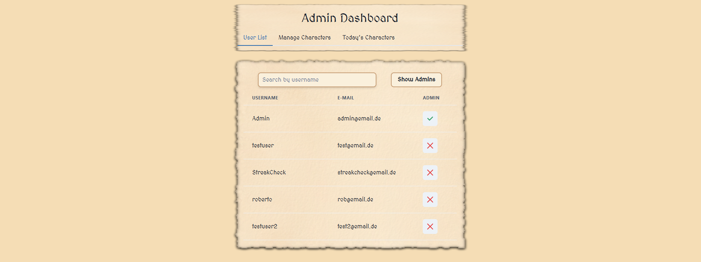

# FWE WS24/25 Project GoTdle

## Table of Contents

1. [Getting started](#getting-started)
2. [Application Functionalities](#application-functionalities)
3. [Routes](#routes)
4. [CI/CD Pipeline](#cicd-pipeline)

## Getting started

### Prerequisites

Ensure the following software components are installed on your PC:

- [ ] Node.js (JavaScript runtime environment)
- [ ] npm (Node Package Manager)
- [ ] Git
- [ ] Docker and Docker Compose

1. Install __Node.js__ and __npm__

   Visit the [Node.js website](https://nodejs.org/).
   Download the recommended version for your platform (LTS version is recommended).
   Follow the installation instructions for your operating system.
   Verify the installation:

    ```bash
    node -v
    npm -v
    ```

2. Install __Git__

   Visit the [Git website](https://git-scm.com/).
   Download the recommended version for your platform.
   Follow the installation instructions for your operating system.
   Verify the installation:

    ```bash
    git --version
    ```

3. Install __Docker__ and __Docker Compose__

   Visit the [Docker website](https://www.docker.com/).
   Download the recommended version for your platform.
   Follow the installation instructions for your operating system.
   Verify the installation:

    ```bash
    docker --version
    docker-compose --version
    ```

### Clone the Repository

Clone the repository to your local machine:

```bash
git clone https://code.fbi.h-da.de/sthiohnoo/gotdle.git
```

### Backend Setup

### Step 1: Navigate to the Backend Directory

```bash
cd gotdle/backend
```

### Step 2: Install Dependencies

Install the necessary dependencies using npm:

```bash
npm install
```

### Step 3: Set Up Environment Variables

To configure the application to use the database in Docker, follow these steps:

1. Create a `.env` file in the src directory and copy the `.env.example` file content into it.
2. Edit the `.env` file and replace the placeholders(user, password, database) with the actual values from
   `docker-compose.yml`

### Step 4: Set Up the Database

Set up the database using Docker Compose:

```bash
docker-compose up -d
```

### Step 5: Migrate the Database

Run the database migrations to create the necessary tables:

```bash
npm run db:migrate
```

### Step 6: Build the Backend

```bash
npm run build
```

### Step 7: Start the Backend

```bash
npm start
```

## Frontend Setup

### Step 1: Navigate to the frontend directory:

```bash
cd frontend
```

### Step 2: Install Dependencies

Install the necessary dependencies using npm:

```bash
npm install
```

### Step 3: Build the Frontend

```bash
npm run build
```

### Step 4: Start the Frontend

```bash
npm run preview
```

### Step 4: Access the Application

Open a browser and navigate to `http://localhost:4173/` or click the link in the terminal.

## Application Functionalities

- [Classic Mode](#classic-mode)
- [Quotes Mode](#quotes-mode)
- [Image Mode](#image-mode)
- [Success Box](#success-box)
- [Score Box](#score-box)
- [Scoreboard](#scoreboard)
- [Profile](#profile)
- [Admin Dashboard](#admin-dashboard)
- [Login](#login)
- [Register](#register)
- [Admin Dashboard](#admin-dashboard)

## Base

- [ ] __Manage Users:__ Create, read, update, and delete users.
- [ ] __Manage Scores:__ Playing the game will update the user's score and can be seen in the leaderboard.
- [ ] __Manage Streaks:__ Playing all Modes will increase the user's streak and can be seen in the leaderboard.
- [ ] __Play Game:__ Play the 3 Modes with daily updated questions with internal and external APIs.

## Classic Mode


- [ ] **Guess Characters:**  
  Try to guess a character, and your guess will be added to a grid.  
  The grid reveals whether the attributes match the correct character:
    - **Green:** The attribute matches.
    - **Red:** The attribute does not match.  
      For **First Appearance** and **Last Appearance**, incorrect guesses will display an arrow indicating if the
      correct value is higher or lower.

### Character Attributes

| **Attribute**        | **Examples**                     | **Description**                               |
|----------------------|----------------------------------|-----------------------------------------------|
| **Gender**           | Female, Male                     | Specifies the character's gender.             |
| **House**            | Targaryen, Stark, etc.           | Indicates the house the character belongs to. |
| **Origin**           | Winterfell, King's Landing, etc. | Defines the character's place of origin.      |
| **Status**           | Alive, Deceased, Unknown         | Shows the character's current status.         |
| **Religion**         | Old Gods, Many-Faced God, etc.   | The religion the character follows.           |
| **First Appearance** | S1 - S8                          | The season when the character first appeared. |
| **Last Appearance**  | S1 - S8                          | The season when the character last appeared.  |

### Hints

- [ ] **Titles:** Shows the character's titles.
    - enabled after 3 incorrect guesses
- [ ] **Actor:** Shows the actor who played the character.
    - enabled after 6 incorrect guesses

## Quotes Mode


- [ ] **Guess Quotes:**
- Try to guess the character who said the quote.
- The color of the box of the character will reveal the guess:
    - **Green:** The quote matches the character.
    - **Red:** The quote does not match the character.

## Image Mode


- [ ] **Guess Characters by a blurred image:**
- Try to guess the character from the image.
- The image will be blurred initially, and every incorrect guess will make the image slightly less blurred.
    - Up to 20 times
- The color of the box of the character will reveal the guess:
    - **Green:** The image matches the character.
    - **Red:** The image does not match the character.

## Success Box


- [ ] **Displayed everytime a mode is completed:**
- Shows the correct answer and the user's score.
- The user can choose to play the next mode
    - when all modes are completed, it directs the user to the leaderboard.
- The time until the next character is revealed

## Score Box


- [ ] **Displayed when all modes are completed:**
- Shows the user's score in each mode and the total score.
- Shows the streak of the user (length of daily made completions of the game without missing a day).
- The user can copy the score to the clipboard and share it with friends.
- The user can share directly to Twitter.

## Scoreboard


- [ ] **Displayed when the user clicks on the leaderboard button:**
- Shows a table of all users
- contains the user's name, rank, created at, current streak, longest streak and scores in each mode.
- can be sorted by all columns by clicking on the column name and will be indicated by an arrow.

## Profile


- [ ] **Displayed when the user clicks on the profile button:**
- Shows the username, email, member since, current streak, longest streak, last played and scores in each mode.
- For every mode the user can see the improvement or decrease in the score compared to the last time the mode was
  played.
- The user can change the username and email and passwort.
- The user can delete the account after entering the password.

## Admin Dashboard




- [ ] **Displayed when the user clicks the admin dashboard button. This button is visible only to users with admin
  rights:**
- On the dashboard page, the user can navigate between two tabs: User List and Manage Characters.
- **User List:**
    - Shows a table of all users.
    - The user can grant or revoke admin rights to another user by simply clicking the ✔ or ❌ icons.
    - The user can search for a user by username.
    - The user can use the 'Show Admins' button to display only the admins in the list.
- **Manage Characters:**
    - The user can create and delete characters.
    - For creating a character, the user needs to upload a json file with the character data.
    - The uploaded file will be shown in the text field, which is also editable.
    - For deleting characters, simply press the delete button. All characters will be deleted.
    - Below the Create/Delete box, the user can see all saved characters in card format.
    - Each card shows only a few details about the character. When the user clicks on a card, a modal opens with all the
      character's information.


## Login


- [ ] **Displayed when the user is not logged in or clicks on the login button:**
- The user can log in with the username or email and password.
- The user can swap between login with username or email.
- The user can click on the register button to register a new account.

## Register


- [ ] **Displayed when the user clicks on the register button:**
- The user can register with a username, email and password.
- If the user is already registered, the user can click on the "Log in here!" text to change to the login page.
- The username needs to be unique and the email needs to be a valid email address.
- The password needs to be at least 8 characters long.

## Admin Dashboard

- [ ] **Displayed when the user is logged in and has the role of an admin:**
- The dashboard can toggle between User List and Manage Characters.
- In User List the admin can:
    - Make other users admins or remove the admin role from other admins.
    - View all users, which can be filtered by admin role or searched by username.
    - Note: The admin can't remove the admin role from himself.
- In Manage Characters the admin can:
    - Upload a JSON file to create new characters in the database.
        - A preview is provided to show the characters.
    - Manually type character information to create new characters.
    - Delete all characters.
    - A list of all characters is displayed below.
        - Clicking on a character shows a more detailed view.

## Routes

All routes, except for user registration/login, are secured so that only authenticated users, meaning logged-in users,
have access. Additionally, some routes are also protected so that only users with admin rights can access them.

__User Routes:__

- [ ] GET /users
    - Description: Get all users
    - Response: 200 Array of user objects
- [ ] GET /users/me
    - Description: Get the current user
    - Response: 200 User object
- [ ] GET /users/search
    - Description: Search for users by username
    - Response: 200 Array of user objects
- [ ] PUT /users
    - Description: Update the current user
    - Request: User object
    - Response: 200 User object
    - Error: 400 Email/Username already exists
- [ ] PUT /users/is_admin/:userId
    - Description: Grant or revoke admin rights to a user
    - Request: Params: userId & Body: {isAdmin: boolean}
    - Response: 200 User object
    - Error: 404 User not found / 400 Cannot change own admin state
- [ ] DELETE /users
    - Description: Delete the current user
    - Response: 204 No Content
    - Error: 401 Password incorrect

__Score Routes:__

- [ ] PUT /scores
    - Description: Update the current user's scores
    - Request: Score object
    - Response: 200 Score object
- [ ] PUT /scores/daily
    - Description: Update the current user's daily streak
    - Request: Score object
    - Response: 200 Score object

__Character Routes:__

- [ ] POST /characters
    - Description: Create a new character
    - Request: Character object
    - Response: 201 Character object
    - Error: 409 Characters Name already exists
- [ ] GET /characters
    - Description: Get all characters
    - Response: 200 Array of character objects
- [ ] DELETE /characters
    - Description: Delete all characters
    - Response: 204 No Content

__Auth Routes:__

- [ ] POST /auth/register
    - Description: Register a new user
    - Request: User object
    - Response: 201 User object
    - Error: 400 Bad Request
- [ ] POST /auth/login
    - Description: Log in the user
    - Request: User object
    - Response: 200 access token
    - Error: 401 Invalid credentials

## CI/CD Pipeline

This project uses GitLab CI/CD to automate the testing, building, and deployment of the application. The pipeline is
defined in the `.gitlab-ci.yml` file and consists of the following stages:

### Stages

1. **Test**: Runs the tests for the backend and frontend.
2. **Build**: Builds Docker images for the backend and frontend.
3. **Deploy**: Deploys the application to the production server.

### Steps

1. **Before Script**: Logs in to the Docker registry.
2. **Test Backend**:
    - Uses the `node:22` image.
    - Installs dependencies and runs tests for the backend.
3. **Test Frontend**:
    - Uses the `node:22` image.
    - Installs dependencies and runs tests for the frontend.
4. **Build Backend**:
    - Builds the Docker image for the backend.
5. **Build Frontend**:
    - Builds the Docker image for the frontend.
6. **Deploy**:
    - Uses the `alpine` image.
    - Deploys the application to the production server using `docker-compose`.

## Description

Let people know what your project can do specifically. Provide context and add a link to any reference visitors might be
unfamiliar with. A list of Features or a Background subsection can also be added here. If there are alternatives to your
project, this is a good place to list differentiating factors.

## Badges

On some READMEs, you may see small images that convey metadata, such as whether or not all the tests are passing for the
project. You can use Shields to add some to your README. Many services also have instructions for adding a badge.

## Support

Tell people where they can go to for help. It can be any combination of an issue tracker, a chat room, an email address,
etc.

## Authors and acknowledgment

Show your appreciation to those who have contributed to the project.

## License

For open source projects, say how it is licensed.

## Project status

If you have run out of energy or time for your project, put a note at the top of the README saying that development has
slowed down or stopped completely. Someone may choose to fork your project or volunteer to step in as a maintainer or
owner, allowing your project to keep going. You can also make an explicit request for maintainers.
